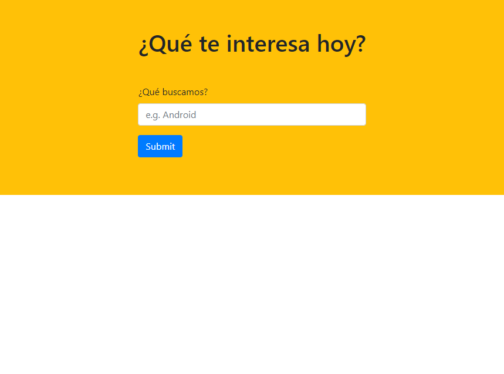
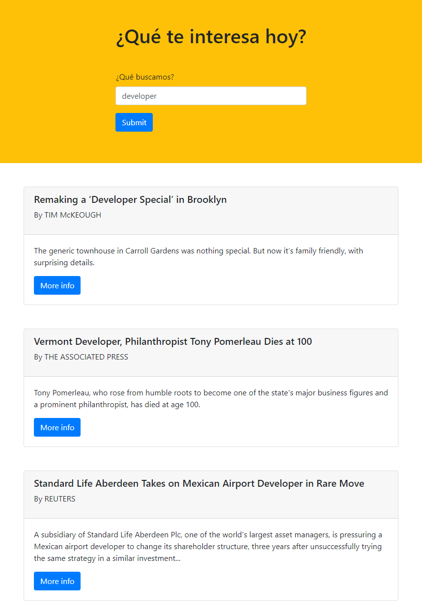

# XHR PROJECT DEMO - Fetch

* **Track:** _FRONT-END-DEVELOPER_
* **Curso:** _Construye una Single Page App (spa) multi-usuario consumiendo data remota_
* **Unidad:** _3_

***

## Objetivo

Hacer una petición a la página del NY Times y que con la respuesta podamos ocupar sus noticias.

## Plan de trabajo

El proyecto se desarrolló siguiendo los siguientes pasos:

1. Crear una cuenta de desarrollador aquí https://developer.nytimes.com/ Nos enviarán una clave de acceso, con ella haremos las peticiones.
2. Crear un proyecto con sus archivos HTML, CSS y JS.
3. Crear una función llamada `getNews()` y es en esta función donde crearemos las peticiones.
4. Hacer uso del método `.open()` y es aquí donde debemos poner la clave que llegó a nuestro correo.
5. Usar las propiedades `.onload` y `.onerror` y asignarles funciones.
6. Enviar la petición con el método `.send()`.

## Especificaciones

* Se utilizó la librería jQuery en su versión 3.2.1 (necesario para bootstrap).
* Se utilizó el framework bootstrap en su versión 4.0.
* Se utilizó el estándar más recientemente aceptado de JavaScript ES2015 || ES6.
* Se utilizó el Web Server de Node.js

***

## Uso
* El usuario tiene la opción de colocar una palabra clave y buscar las noticias/artículos relacionados.
* En el navegador se muestran 10 noticias/artículos y por cada uno se tiene un botón para re-direccionar al usuario a la página del NY Times y leerlo completo.

## Demo
Para ver el demo dar click [aquí](https://rocciescobar.github.io/NY-Times_XMLHttpRequest/public/index.html "titulo").

## Ejemplo
* Se busca la palabra 'developer':

***

## Autora

* Rocci Escobar Nuñez [Cuenta GitHub](https://github.com/Rocciescobar "titulo")